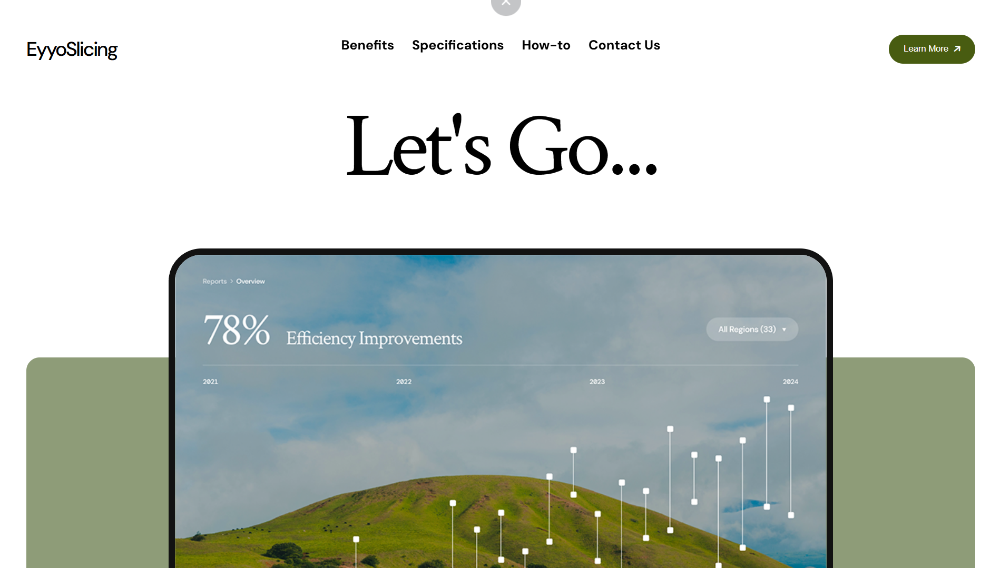

"# slicing-figma-modern-design" 
# 🎨 EyyoSlicing - Modern Website

A sleek, responsive website for a modern cosmetic brand built with HTML5, CSS3, and JavaScript. Features elegant typography, smooth animations, and mobile-first responsive design.

## ✨ Live Demo

[🔗 View Live Website](#) https://aqilbintang.github.io/slicing-figma-modern-design/

## 🚀 Features

### 📱 **Responsive Design**
- Fully responsive across all devices (Desktop, Tablet, Mobile)
- Mobile-first approach with progressive enhancement
- Fluid typography and spacing
- Optimized images for different screen sizes

### 🎯 **Key Sections**
1. **Hero Section** - Eye-catching product showcase
2. **Benefits** - Clear value propositions
3. **Features** - Detailed product specifications
4. **Comparison Table** - Competitive analysis
5. **Testimonials** - Customer reviews
6. **Interactive Map** - Success visualization
7. **Contact Section** - Call to action

### 💫 **Special Features**
- Smooth scroll animations with AOS.js
- Custom counter implementation with CSS
- Blur effect navigation bar
- Hover interactions and transitions
- Performance-optimized assets

## 🛠️ Technologies Used

| Technology | Purpose |
|------------|---------|
| **HTML5** | Semantic markup |
| **CSS3** | Modern styling with Grid & Flexbox |
| **JavaScript** | Interactive elements |
| **AOS Library** | Scroll animations |
| **FontAwesome** | Icons |
| **Google Fonts** | Typography |

## 🎨 Design Highlights

### **Typography**
- **Headings**: Crimson Text (Serif)
- **Body**: DM Sans (Sans-serif)
- **Monospace**: Roboto Mono, Reddit Mono
- **Accent**: Rethink Sans

### **Color Palette**
``css
Primary:   #485C11      /* Brand green */
Secondary: #DFECC6      /* Light mint */
Text:      #000000      /* Black */
Subtext:   #6F6F6F      /* Gray */
Background:#FFFFFF      /* White */
Accent:    #8E9C78      /* Muted green */

###Responsive Breakpoint
/* Desktop: > 1042px */
/* Tablet: 784px - 1042px */
/* Mobile: < 784px */

#Getting started
1. Clone the repository
git clone https://github.com/AqilBintang/slicing-figma-modern-design
2. Navigate to project directory
3. Open index.html in your browser or use a local server
owser or use a local server
